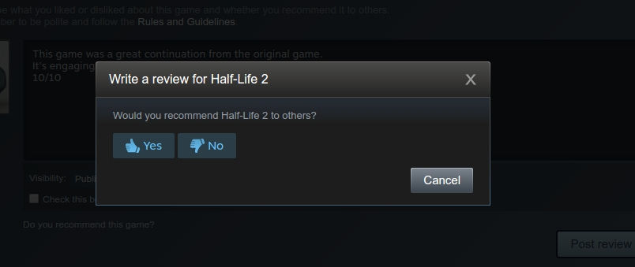

###Classifying the Steam user community's language 

The online gaming platform Steam is an excellent source of training data for text analysis. The reason is the way people are required to make reviews.

When you leave a review on Steam, you must mark the review as 'Recommended' or 'Not Recommended'. That makes the Steam reviews a useful dataset, since we can use the reviewers' own stated intentions to know the purpose of the review that was typed.

So I've scraped thousands of reviews from many hundreds of games of varying genres. I think some of these are also software packages, but Steam is primarily a game store and platform.

To classify the reviews, I've used several machine learning algorithms that are useful for text analysis. Those are: Multinomal Naive Bayes, Linear SVC, SVC and Logistic Regression. There's an excellent reading material on each of these algorithms below.

###Data accuracy and concerns

Some of the reviews I've found on Steam are interesting - check [this catalogue](/issues) of interesting reviews I've found.

Addressing this has involved, partially, scraping a large number of reviews - 5000 to start with and potentially more if needed.

Another potential issue is having an uneven dataset, which would skew the classifiers. There seems to be a disproportionately large number of positive reviews the scraper picks up. For that reason, this program will train each classifier with an even number of 'Recommended' and 'Not Recommended' reviews each time, which should help reduce the bias in this data. So for every 'Recommended' review, we will need a 'Not Recommended' before we can classify.

Underlying this project is the naive assumption that most reviews will be roughly the same size in word length, but the sizes of reviews may introduce bias into these results.

###Some results and a pretty chart

Most Scikit-Learn classifiers (except the Multinomial Naive Bayes classifier) do not allow to partial_fit(). Using that function allows training the classifier with new data on the go. Therefore, the classifiers are trained with increasingly-large batches of data from the database of steam reviews.

To do this, a module called data_prep retrieves data in increments of 100. Each time those reviews were 50% 'Recommended' and 50% 'Not Recommended'.

#####The process

So the first round of training and classifying is with 200 reviews. The classifier is trained with the first 100 (50 'Recommended' and 50 'Not Recommended'). Then we get the classifiers to predict the other 100 reviews, also evenly-split. Next time the program will retrieve 300 reviews, train the classifiers with the first 200, and use the other 100 to get the classifiers predict the intention of each review. The results of each 100 review block is saved to a database. 

For example, if each classifier accurately predicts 80% of 'Recommended' reviews and 60% of 'Not Recommended' reviews from that block, the results for that block are saved as the average, 70%.

This scoring process will be for every classifier.

An idea to extend this project is to use the partial_fit() method with the Multinomial Naive Bayes classifier. You could pass in reviews to the classifier in increments. The classifier could be saved as a binary file using Pickle, so none of the work is lost. That could be used to make a classifier that responds to a dataset that changes over time.

###Software used in this project

This project was developed with Python3 on Ubuntu 16.04. 

This uses Scikit-Learn, nuMpy, Python-Requests and BeautifulSoup4.

This also uses sqlite3, but I think that comes standard with Python3.

The Python-standard module, unittest is used for unit testing.

###Installation

Clone this repo down to your machine.

I'd recommend using a virtualenv:

    virtualenv -p python3 env

Activate that virtualenv:

    source env/bin/activate

Install all dependencies:

    pip3 install -r requirements.txt

Now you're good to go.

###Usage

This project has a single interface for the user to use. To use the program:
    
    #Continue scraping Steam
    python3 run_app.py scrape_steam continue

    #Clear out steam_reviews table and start scraping again
    python3 run_app.py scrape_steam new

    #Continue classifying data
    python3 run_app.py classify_data

    #Get statistics from classification data
    python3 run_app.py make_report

If you're running this project from a terminal, be sure to use ctrl+c to close this program. I've found ctrl+z will close your database if any process is using it, which means the lock that process put on the db will remain and you'll have to unlock it. I haven't found a reliable way to unlock these databases.

###Unit tests

This is the first time I've embraced Test Driven Development, meaning I wrote my tests and watched them fail before writing the code to make them pass. 

For this reason, the majority of functions in this project have tests. There are some functions, like the larger controller functions (these only call other functions anyway) that don't have tests.

To run the tests, got to the terminal and type:

    python3 unit_test.py

I've put all tests in one file, but you can shift them around if you like because they all setUp() and tearDown() their own requirements.

An internet connection is required for the tests to pass, since some tests scrape steam.

###Licence

If you can find a reason to use this project, go ahead. No license applies for my work. 

I scraped Steam for educational purposes and not for any commercial reason, so I think you should do the proper thing and not use the database for commercial reasons too.

Of course the people who made Requests, BeautifulSoup4, Scikit-learn, Scipy and numPy deserve credit for the modules that this project relies on (quite a heavy reliance).

###Final thoughts - I like TDD

I'm really happy with how this turned out. I used test driven development throughout this project, where I could. Most tests were written first, failed, then made to work.

I think TDD is good for writing a function that you've seen before. It helps you keep the function simple. It helps you slow down and think about what the function does and why rather than rushing in like a cowboy.

The circumstance where I wouldn't use TDD is where I'm exploring a new concept and just don't know what to expect. Some of this code was fleshing out ideas and exploring new things, and for that, I didn't find TDD very helpful.

I've effectively managed complexity within this project by focussing on keeping things simple. The modular design has really helped, as has the TDD.