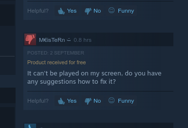
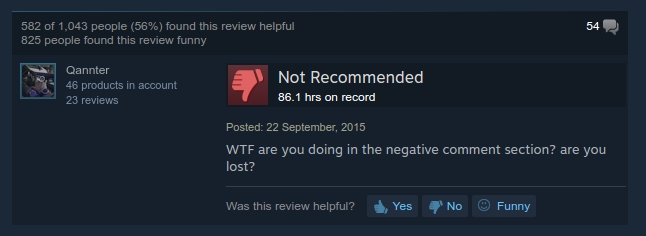
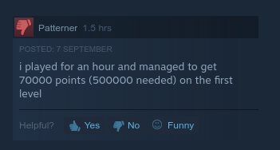
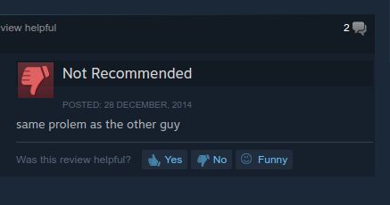
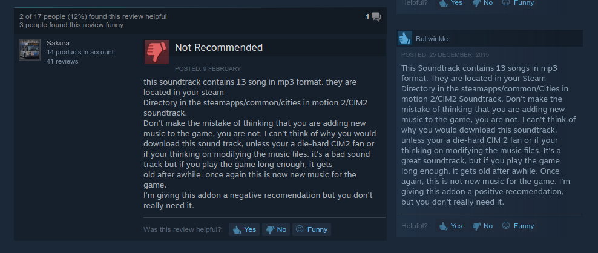

This dataset is a mess, as is all real-world data. I've tried to smooth out some of the issues by taking lots of data.

#####Here's a category of some issues encountered.

This user seems to need techical support.

This is for a very successful game, Halflife 2. Clearly not a negative review.

This person seems to lack skill.

What even is this? This means nothing.

What happened here?

